# 🎬 AI 短剧管线 — 全流程架构

> 从剧本到成片，五阶段生产管线详解

---

## 全局总览

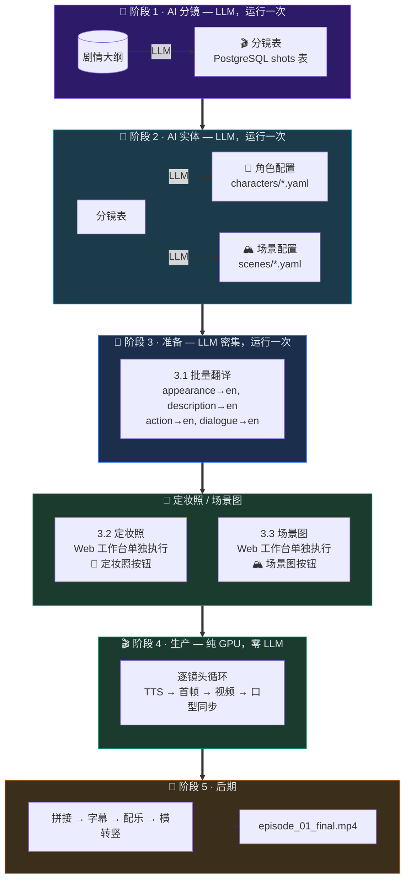

---

## 阶段 1 · AI 分镜

> 从大纲生成分镜表。已有角色/场景时自动注入 prompt 提升质量。

| 操作 | Web 工作台路径 | 依赖 |
|------|----------------|------|
| 生成分镜表 | 「📝 分镜表」→「🤖 AI 生成」 | LLM |

**产出：**
- PostgreSQL 数据库 — 分镜表（shots 表）

**注意：** 分镜生成后，会提示引用了哪些未创建的角色/场景。请执行阶段 2 生成。

---

## 阶段 2 · AI 实体

> 从分镜提取引用的角色/场景，批量 AI 生成缺失的配置。只生成缺失的，不覆盖已有。

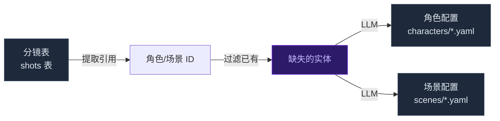

| 操作 | Web 工作台路径 | 依赖 |
|------|----------------|------|
| AI 生成角色/场景 | 「🎬 生产管线」→「👥 AI 生成角色/场景」 | LLM |
| 手动创建角色 | 「👤 角色」→「+ 新建」 | 无 |
| 手动创建场景 | 「🏔️ 场景」→「+ 新建」 | 无 |

**产出文件：**
- `projects/<项目>/config/characters/*.yaml` — 角色配置（唯一数据源）
- `projects/<项目>/config/scenes/*.yaml` — 场景配置（唯一数据源）

**两种路径：**
- **快速起步**：分镜 → AI 实体 → 准备 → 生产（零配置）
- **精细化**：手动创建角色/场景 → 分镜（注入已有实体） → 补充缺失 → 准备 → 生产

---

## 阶段 3 · 准备

> 批量翻译集中完成。运行一次后，生产管线 **零 LLM 调用**。角色圣经（character bible）通过 Web 工作台「📝 分镜表」→「🤖 AI 生成角色圣经」生成。

#### 执行顺序

```
progress 10%  扫描角色/场景/分镜
progress 40%  批量翻译（outfits/场景/分镜的 _en 字段）
progress 80%  回写翻译结果到 YAML + DB
progress 90%  视角 prompt 生成（appearance → appearance_prompt_en）
progress 100% 完成
```

> **注意**：`appearance`（角色外貌）不参与批量翻译，由视角 prompt 生成步骤专门处理。
> 该步骤将中文外貌描述直接转换为 AI 绘图专用 prompt（含性别标签、体型关键词等），
> 避免"先翻译再格式化"的两次 LLM 调用互相覆盖。

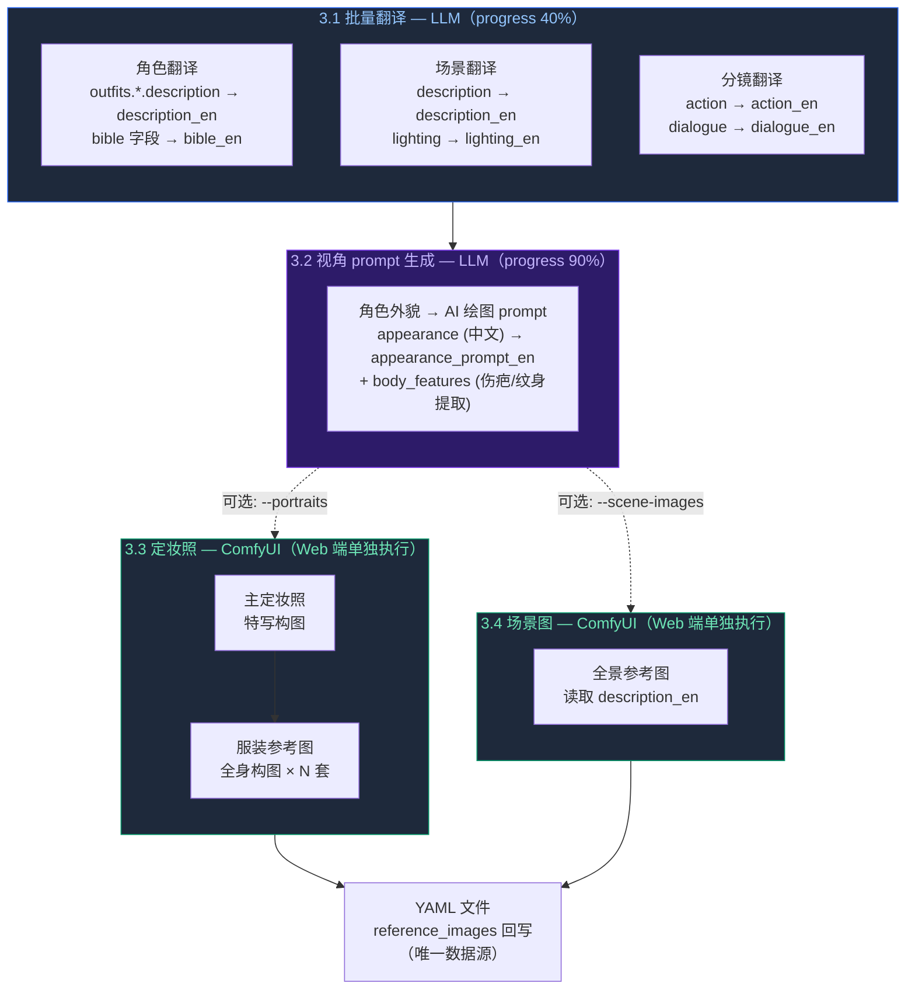

| 操作 | Web 工作台路径 | 依赖 |
|------|----------------|------|
| 批量翻译 + 视角 prompt | 「🎬 生产管线」→「🔧 准备阶段」 | LLM |
| 强制重新生成（覆盖已有） | 同上，勾选「强制覆盖」 | LLM |

> 定妆照和场景图通过 Web 工作台「📸 定妆照」「🏔️ 场景图」单独执行，支持单角色/单场景按需生成。

### 翻译策略

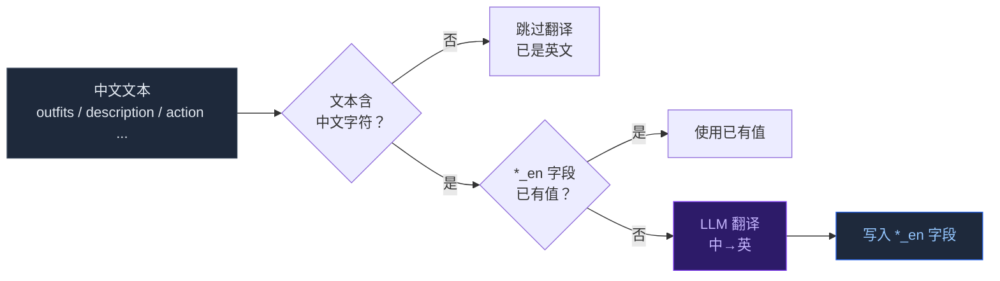

### 收益

| 场景 | 无 prepare | 有 prepare |
|------|-----------|-----------|
| 10 个镜头 | 30-40 次 LLM 调用 | **0 次** LLM 调用 |
| 生产速度 | 受 LLM 延迟限制 | **纯 GPU 全速** |

---

## 阶段 4 · 生产

> 纯 GPU/本地执行，零 LLM 调用。逐镜头完成 TTS → 首帧 → 视频 → 口型同步。**不含后期合成**（后期由 Web 工作台「📦 后期合成」独立处理）。

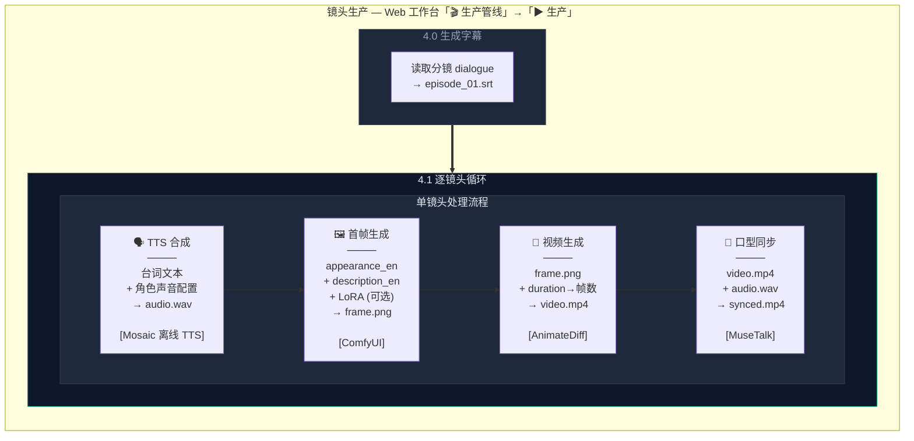

### 单镜头四步详解

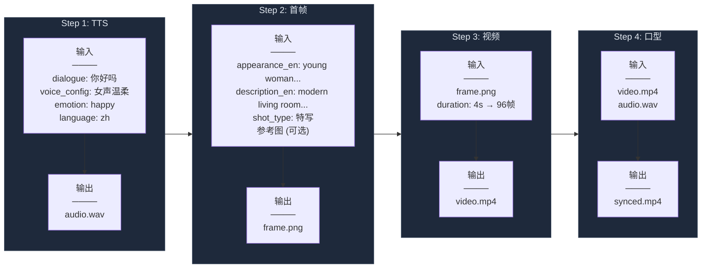

### produce 内部子步骤与进度

| 步骤 | 进度 | 说明 |
|------|------|------|
| 4.0 生成字幕 | 0-5% | 读分镜 dialogue → SRT 文件 |
| 4.1 逐镜头循环 | 5-100% | 每个镜头: TTS → 首帧 → 视频 → 口型 |

---

## 阶段 5 · 后期

> 后期合成通过 Web 工作台「🎬 生产管线」→「📦 后期合成」执行，用于**重做后期**而不重新生成镜头。

```mermaid
flowchart LR
    subgraph input["输入"]
        v1["s001/synced.mp4"]
        v2["s002/synced.mp4"]
        v3["s003/synced.mp4"]
        vn["sN/synced.mp4"]
        srt["episode_01.srt"]
        bgm["bgm.wav"]
    end

    subgraph process["处理流程"]
        direction LR
        concat["✂️ FFmpeg 拼接<br/>crossfade 转场<br/>transition_duration: 0.5s"]
        subtitle["📝 字幕叠加<br/>SRT 烧录到画面"]
        music["🎵 配乐混合<br/>BGM 音量 0.15"]
        vertical["📱 横转竖<br/>9:16 人脸追踪"]
        concat --> subtitle --> music --> vertical
    end

    subgraph output["输出"]
        final["episode_01_final.mp4"]
    end

    input --> process --> output

    style input fill:#1e293b,stroke:#334155,color:#94a3b8
    style process fill:#1e293b,stroke:#d97706,color:#fcd34d
    style output fill:#3b2e1b,stroke:#d97706,color:#fcd34d
```

| 操作 | Web 工作台路径 |
|------|----------------|
| 后期合成（横屏） | 「🎬 生产管线」→「📦 后期合成」 |
| 后期合成 + 横转竖 | 同上，勾选「横转竖」 |

---

## Web 工作台操作流程

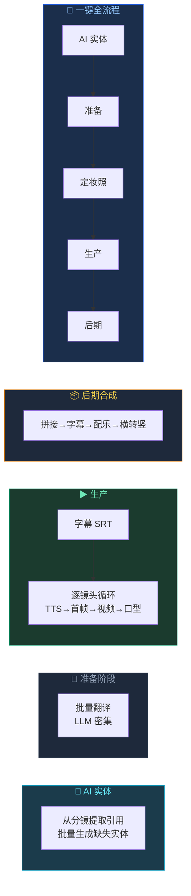

| 操作 | 说明 |
|------|------|
| 「👥 AI 生成角色/场景」 | 从分镜提取引用，批量生成缺失实体（LLM） |
| 「🔧 准备阶段」 | 批量翻译（LLM 密集，运行一次即可） |
| 「▶ 生产」 | 镜头生产（纯 GPU，零 LLM） |
| 「📦 后期合成」 | 拼接、字幕、配乐、横转竖 |
| 「🚀 一键全流程」 | AI 实体 → 准备 → 定妆照 → 生产 → 后期 |

---

## 数据流全景

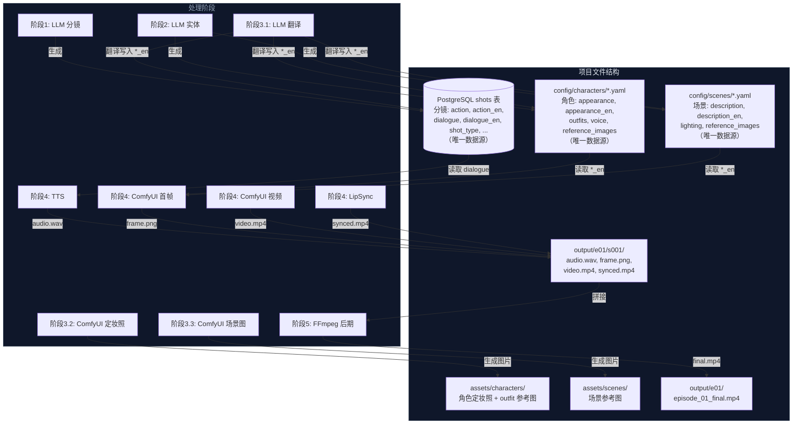

---

## 角色面部一致性

> 通过 `consistency_method` 配置项选择一致性方案，与图像后端独立解耦

### 配置

```yaml
# config/system.yaml
consistency_method: auto   # auto / pulid_flux / ip_adapter / none
```

| 值 | 说明 | 适用后端 |
|----|------|---------|
| `auto` | 根据 image_backend 自动选择 | flux→pulid, sd15→ip_adapter, cosmos→none |
| `pulid_flux` | PuLID-Flux 面部一致性 | Flux（DiT） |
| `ip_adapter` | IP-Adapter Plus 面部一致性 | SD1.5/SDXL（UNet） |
| `none` | 不使用一致性（仅 LoRA + seed） | 全部 |

> **自动节点检测**：启动时调用 ComfyUI `/object_info` 获取已注册节点类型，与各方案的 `required_comfyui_nodes`（定义在 `models_registry.yaml`）比对。若所需插件未安装，对应方案自动跳过并记录 Warning，不中断管线。检查统一在 `inject_from_registry()` 入口执行，覆盖泛型 `NodeGraphInjector` 和 `inject_method` 覆盖（如 ControlNet Depth）两条路径。

### PuLID-Flux（Flux 后端推荐）

> InsightFace 检测人脸 → EVA CLIP 编码 → 注入 Flux DiT 注意力层

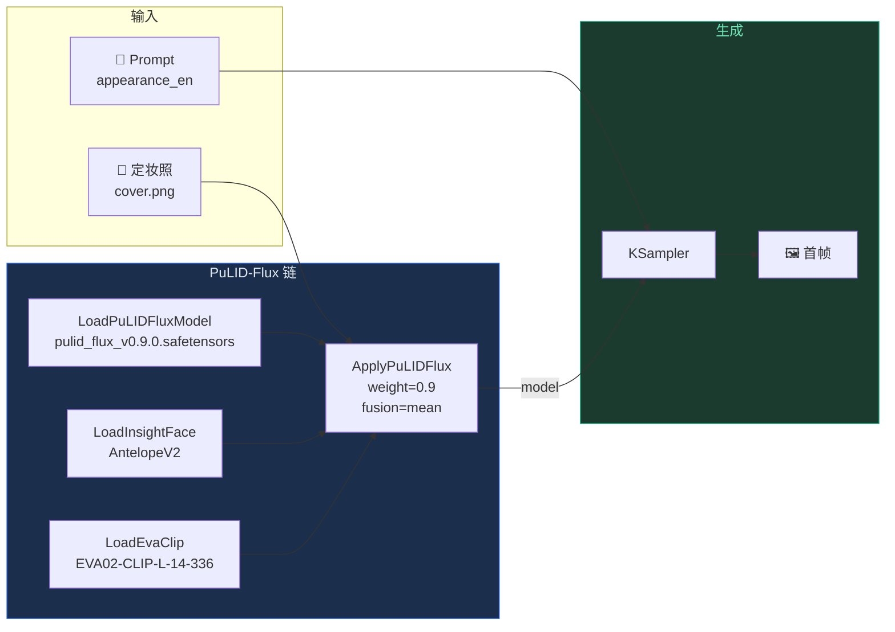

| 配置项 | 默认值 | 说明 |
|--------|--------|------|
| `pulid_flux.model` | `pulid_flux_v0.9.0.safetensors` | PuLID Flux 模型 |
| `pulid_flux.weight` | `0.9` | 面部权重（推荐 0.8-0.95，1.0 过拟合） |
| `pulid_flux.fusion` | `mean` | 多图融合: mean / concat / max / train_weight |
| `pulid_flux.use_gray` | `true` | 灰度优化（边缘轮廓更自然） |

### IP-Adapter Plus（SD1.5/SDXL 后端）

> CLIP Vision 编码参考图 → IP-Adapter 注入 UNet cross-attention 层

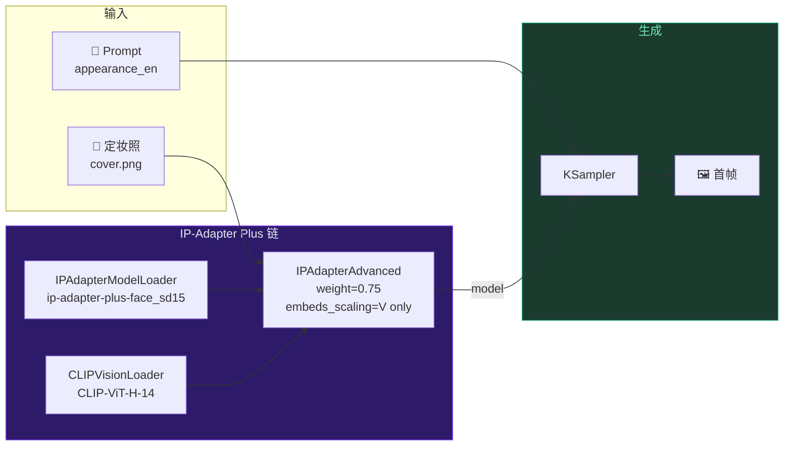

| 配置项 | 默认值 | 说明 |
|--------|--------|------|
| `ip_adapter.model` | `ip-adapter-plus-face_sd15.safetensors` | 面部一致性最佳 |
| `ip_adapter.weight` | `0.75` | 参考图影响力（0-1） |
| `ip_adapter.embeds_scaling` | `V only` | 面部特征保持最佳 |
| `ip_adapter.secondary_weight` | `0.45` | 多角色时次要角色权重 |

**多角色同框**：两种方案均自动链式注入，主角色高权重，次要角色自动降权。

---

## 服务依赖

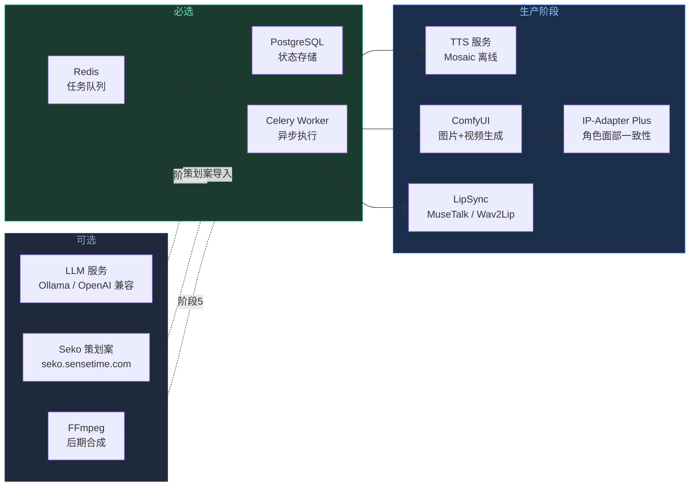

---

## 快速参考

```
首次使用:
1. 启动服务: drama serve + drama worker
2. Web 工作台生成内容（大纲 → 分镜 → AI 实体）
3. 准备阶段（批量翻译）
4. 生成定妆照 + 场景图
5. 生产 → 后期 → 成片

服务管理:
  drama serve    — 启动 Web 工作台
  drama worker   — 启动 Celery Worker
  drama status   — 查看服务状态
```
